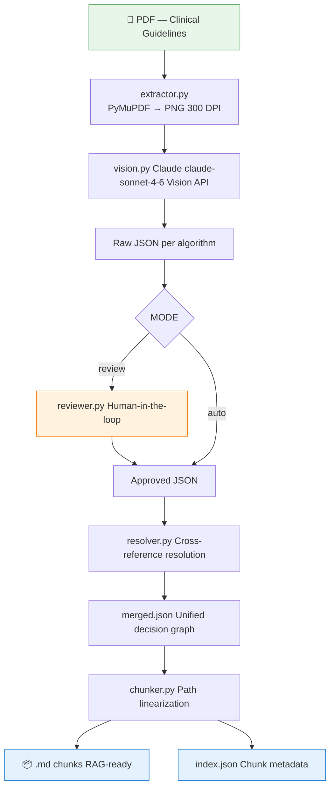
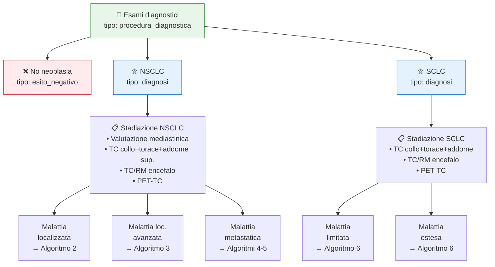
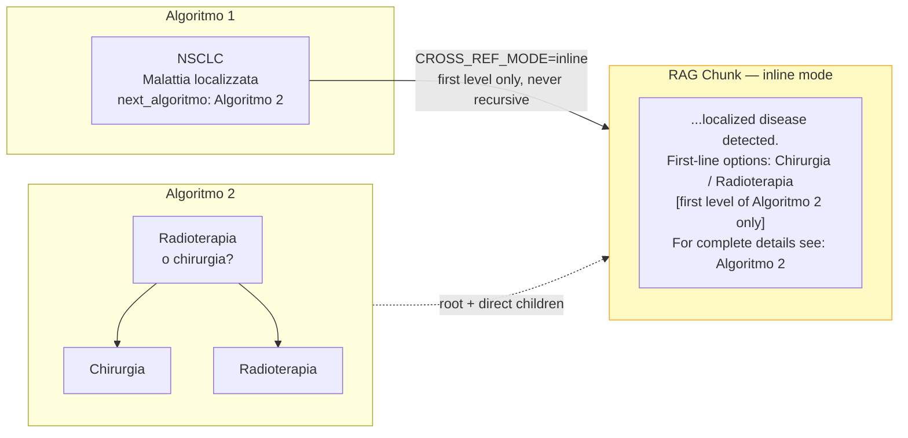
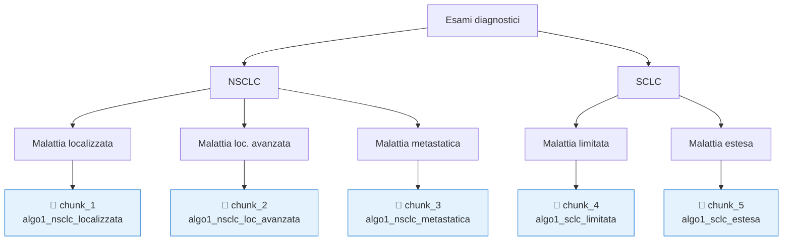

#Flow to RAG

Extract clinical decision flowcharts from rasterized PDFs and convert them into structured, RAG-ready text chunks, preserving the decision logic that standard OCR destroys.
---

## The Problem

Clinical guidelines like AIOM 2024 encode critical decision logic inside **flowcharts**.

!image.png

Standard OCR pipelines extract text but destroy the structure:

```
# What OCR produces from a clinical flowchart:
"Esami diagnostici Esame obiettivo Rx torace TC torace NSCLC SCLC
Valutazione mediastinica TC collo PET-TC Malattia localizzata Algoritmo 2"
```

A RAG system built on this output cannot answer:
*"What staging exams are required for a patient with NSCLC and localized disease?"*

The text is there. The reasoning is not.

Some papers used for the project:

https://aclanthology.org/2025.naacl-long.180/

https://arxiv.org/abs/2512.02170

https://arxiv.org/abs/2601.03475

https://github.com/JunyiYe/TextFlow

https://github.com/bionlplab/CPGPrompt

---

## The Solution

`flowchart-to-rag` uses **LLM vision extraction** to reconstruct the decision graph,
then linearizes each root-to-leaf path into a self-contained text chunk
that preserves the full clinical reasoning context.

```
# What a RAG chunk looks like after this pipeline:
---
fonte: AIOM 2024
algoritmo: Algoritmo 1
percorso: NSCLC > Malattia localizzata
chunk_id: algo1_nsclc_localizzata
---
Diagnostic pathway NSCLC - Localized Disease (AIOM 2024, Algorithm 1):
If diagnostic workup (Esame obiettivo, Rx torace, TC torace, Fibrobroncoscopia)
identifies NSCLC, perform staging: valutazione mediastinica, TC collo + torace
+ addome superiore, TC/RM encefalo, PET-TC.
If presentation = localized disease → follow Algorithm 2 [staging summary].
For complete details see: Algorithm 2.
```

---

## Architecture



---

## Decision Graph Model

Each flowchart is serialized into a recursive JSON tree where every node carries its clinical context, type, and outgoing edges with explicit conditions.



---

## Cross-Algorithm References

Clinical guidelines are not isolated documents — algorithms reference each other.
`flowchart-to-rag` resolves these references and handles them in two configurable modes:



> **Why first-level only?**
Expanding cross-references recursively would chain Algorithm 1 → 2 → 3 → ...
creating chunks that exceed the embedding model's context window and dilute retrieval precision.
> 

---

## Chunking Strategy

Each path from root to leaf becomes an independent chunk.
The chunker traverses the decision tree depth-first and emits one `.md` file per path.



---

## Project Structure

```
flowchart-to-rag/
├── main.py              # CLI entrypoint (argparse)
├── config.py            # algorithm list, page numbers, pipeline settings
├── extractor.py         # PDF → PNG via PyMuPDF at 300 DPI
├── vision.py            # Anthropic vision API + JSON validation + retry
├── resolver.py          # cross-reference resolution → merged.json
├── chunker.py           # JSON tree → linearized .md chunks
├── reviewer.py          # optional human-in-the-loop approval step
├── output/
│   ├── json/
│   │   ├── algoritmo_1_raw.json
│   │   ├── algoritmo_2_raw.json
│   │   └── merged.json          ← unified graph with resolved refs
│   └── chunks/
│       ├── index.json            ← chunk metadata for RAG ingestion
│       ├── algo1_nsclc_localizzata_0.md
│       ├── algo1_nsclc_loc_avanzata_0.md
│       └── ...
└── requirements.txt
```

---

## Installation

```bash
git clone https://github.com/your-username/flowchart-to-rag
cd flowchart-to-rag
pip install -r requirements.txt
```

Create a `.env` file:

```
ANTHROPIC_API_KEY=your_key_here
```

---

## Configuration

Edit `config.py` before running:

```python
ALGORITHMS = [
    {"id": "algoritmo_1", "label": "Algoritmo 1", "page": 12},
    {"id": "algoritmo_2", "label": "Algoritmo 2", "page": 15},
    {"id": "algoritmo_3", "label": "Algoritmo 3", "page": 18},
]

MODE = "auto"            # "auto" | "review"
CROSS_REF_MODE = "inline"  # "inline" | "reference"
PDF_PATH = "aiom2024.pdf"
OUTPUT_DIR = "./output"

# Set based on your embedding model:
# IBM Granite 107M     → 400   (hard limit: 512)
# text-embedding-3-small → 1600 (hard limit: 8191)
# nomic-embed-text     → 700   (hard limit: 2048)
CHUNK_MAX_TOKENS = 400
```

---

## Usage

```bash
# Process all configured algorithms
python main.py --pdf aiom2024.pdf --mode auto

# Process specific algorithms only
python main.py --pdf aiom2024.pdf --algorithms 1,2,3

# Enable human review after each vision extraction
python main.py --pdf aiom2024.pdf --mode review

# Use reference mode instead of inline (separate chunks with pointers)
python main.py --pdf aiom2024.pdf --cross-ref reference

# Full options
python main.py \
  --pdf path/to/guidelines.pdf \
  --mode auto \
  --cross-ref inline \
  --output ./output \
  --algorithms 1,2,3
```

### Console output

```
[1/16] Extracting Algoritmo 1 (page 12)... ✓
[2/16] Vision extraction Algoritmo 1... ✓ (input: 1971 tokens, output: 2207 tokens)
[3/16] Extracting Algoritmo 2 (page 13)... ✓
[4/16] Vision extraction Algoritmo 2... ✓ (input: 1971 tokens, output: 1628 tokens)
[5/16] Extracting Algoritmo 3 (page 14)... ✓
[6/16] Vision extraction Algoritmo 3... ✓ (input: 1971 tokens, output: 2330 tokens)
[7/16] Extracting Algoritmo 4 (page 15)... ✓
[8/16] Vision extraction Algoritmo 4... ✓ (input: 1971 tokens, output: 1100 tokens)
[9/16] Extracting Algoritmo 5 (page 16)... ✓
[10/16] Vision extraction Algoritmo 5... ✓ (input: 1971 tokens, output: 2116 tokens)
[11/16] Extracting Algoritmo 2 (page 17)... ✓
[12/16] Vision extraction Algoritmo 2... ✓ (input: 1971 tokens, output: 1965 tokens)
[13/16] Extracting Algoritmo 2 (page 18)... ✓
[14/16] Vision extraction Algoritmo 2... ✓ (input: 1971 tokens, output: 1486 tokens)
[15/16] Resolving cross-references... ✓ (0 references resolved)
[16/16] Generating chunks... ✓ (54 chunks generated)

Pipeline complete.
Intermediate JSON : ./output\json/ (7 files)
Unified graph     : ./output\json\merged.json
RAG chunks        : ./output\chunks/ (54 files)
Total API tokens  : 13797 input / 12832 output
Estimated cost    : $0.2339 (at current claude-sonnet-4-6 pricing)
```

---

## Human-in-the-Loop Mode

When `MODE = "review"`, the pipeline pauses after each vision extraction
and presents the extracted JSON for approval before generating chunks.

```
Algorithm 1 extracted. Review JSON:

{
  "algoritmo_id": "algoritmo_1",
  "label": "Algoritmo 1 - Diagnosi e Stadiazione",
  ...
}

[A]ccept  [E]dit  [R]egenerate  [S]kip
> _
```

| Option | Behavior |
| --- | --- |
| **A** — Accept | Proceed to chunk generation |
| **E** — Edit | Open JSON in `$EDITOR` (fallback: nano), reload on close |
| **R** — Regenerate | Re-call vision API for this algorithm |
| **S** — Skip | Exclude this algorithm from output |

This mode is recommended for **clinical content** where accuracy is critical.

---

## Output Format

### Intermediate JSON (`output/json/algoritmo_1_raw.json`)

```json
{
  "algoritmo_id": "algoritmo_1",
  "label": "ALGORITMO 1: DIAGNOSI E STADIAZIONE",
  "fonte": "AIOM 2024",
  "nodo_radice": {
    "id": "esami_diagnostici",
    "label": "Esami diagnostici",
    "tipo": "procedura_diagnostica",
    "componenti": [
      "Esame obiettivo",
      "Rx torace",
      "TC torace",
      "Fibrobroncoscopia",
      "± Esame citologico escreato",
      "± Agoaspirato transtoracico"
    ],
    "ambiguita": false,
    "figli": [
      {
        "condizione": "No neoplasia primitiva polmonare",
        "nodo": {
          "id": "no_neoplasia",
          "label": "No neoplasia primitiva polmonare",
          "tipo": "esito_negativo",
          "ambiguita": false,
          "figli": [
            {
              "condizione": null,
              "nodo": {
                "id": "esami_stadiazione_no_neoplasia",
                "label": "Esami di stadiazione",
                "tipo": "procedura_diagnostica",
                "ambiguita": false,
                "figli": []
              }
            }
          ],
          "next_algoritmo": null
        }
      },
      {
        "condizione": "NSCLC",
        "nodo": {
          "id": "nsclc",
          "label": "NSCLC",
          "tipo": "diagnosi",
          "ambiguita": false,
          "figli": [
            {
              "condizione": null,
              "nodo": {
                "id": "valutazione_mediastinica",
                "label": "Valutazione mediastinica (vedi testo)",
                "tipo": "procedura_diagnostica",
                "ambiguita": false,
                "figli": []
              }
            },
            {
              "condizione": null,
              "nodo": {
                "id": "nsclc_tc_collo_torace_addome_superiore",
                "label": "TC collo + torace + addome superiore",
                "tipo": "procedura_diagnostica",
                "ambiguita": false,
                "figli": []
              }
            },
            {
              "condizione": null,
              "nodo": {
                "id": "nsclc_tc_rm_encefalo",
                "label": "TC / RM encefalo",
                "tipo": "procedura_diagnostica",
                "ambiguita": false,
                "figli": []
              }
            },
            {
              "condizione": null,
              "nodo": {
                "id": "nsclc_pet_tc",
                "label": "PET-TC",
                "tipo": "procedura_diagnostica",
                "ambiguita": false,
                "figli": []
              }
            },
            {
              "condizione": "Malattia localizzata",
              "nodo": {
                "id": "nsclc_malattia_localizzata",
                "label": "Malattia localizzata",
                "tipo": "stadiazione",
                "ambiguita": false,
                "figli": [
                  {
                    "condizione": null,
                    "nodo": {
                      "id": "nsclc_algoritmo_2",
                      "label": "Algoritmo 2",
                      "tipo": "riferimento_esterno",
                      "ambiguita": false,
                      "figli": [],
                      "next_algoritmo": "Algoritmo 2"
                    }
                  }
                ],
                "next_algoritmo": null
              }
            },
            {
              "condizione": "Malattia localmente avanzata",
              "nodo": {
                "id": "nsclc_malattia_localmente_avanzata",
                "label": "Malattia localmente avanzata",
                "tipo": "stadiazione",
                "ambiguita": false,
                "figli": [
                  {
                    "condizione": null,
                    "nodo": {
                      "id": "nsclc_algoritmo_3",
                      "label": "Algoritmo 3",
                      "tipo": "riferimento_esterno",
                      "ambiguita": false,
                      "figli": [],
                      "next_algoritmo": "Algoritmo 3"
                    }
                  }
                ],
                "next_algoritmo": null
              }
            },
            {
              "condizione": "Malattia metastatica",
              "nodo": {
                "id": "nsclc_malattia_metastatica",
                "label": "Malattia metastatica",
                "tipo": "stadiazione",
                "ambiguita": false,
                "figli": [
                  {
                    "condizione": null,
                    "nodo": {
                      "id": "nsclc_algoritmi_4_5",
                      "label": "Algoritmi 4-5",
                      "tipo": "riferimento_esterno",
                      "ambiguita": false,
                      "figli": [],
                      "next_algoritmo": "Algoritmi 4-5"
                    }
                  }
                ],
                "next_algoritmo": null
              }
            }
          ],
          "next_algoritmo": null
        }
      },
      {
        "condizione": "SCLC",
        "nodo": {
          "id": "sclc",
          "label": "SCLC",
          "tipo": "diagnosi",
          "ambiguita": false,
          "figli": [
            {
              "condizione": null,
              "nodo": {
                "id": "sclc_tc_collo_torace_addome_completo",
                "label": "TC collo + torace + addome completo",
                "tipo": "procedura_diagnostica",
                "ambiguita": false,
                "figli": []
              }
            },
            {
              "condizione": null,
              "nodo": {
                "id": "sclc_tc_rm_encefalo",
                "label": "TC / RM encefalo",
                "tipo": "procedura_diagnostica",
                "ambiguita": false,
                "figli": []
              }
            },
            {
              "condizione": null,
              "nodo": {
                "id": "sclc_pet_tc",
                "label": "PET-TC",
                "tipo": "procedura_diagnostica",
                "ambiguita": false,
                "figli": []
              }
            },
            {
              "condizione": "Malattia limitata",
              "nodo": {
                "id": "sclc_malattia_limitata",
                "label": "Malattia limitata",
                "tipo": "stadiazione",
                "ambiguita": false,
                "figli": [
                  {
                    "condizione": null,
                    "nodo": {
                      "id": "sclc_algoritmo_6_limitata",
                      "label": "Algoritmo 6",
                      "tipo": "riferimento_esterno",
                      "ambiguita": false,
                      "figli": [],
                      "next_algoritmo": "Algoritmo 6"
                    }
                  }
                ],
                "next_algoritmo": null
              }
            },
            {
              "condizione": "Malattia estesa",
              "nodo": {
                "id": "sclc_malattia_estesa",
                "label": "Malattia estesa",
                "tipo": "stadiazione",
                "ambiguita": false,
                "figli": [
                  {
                    "condizione": null,
                    "nodo": {
                      "id": "sclc_algoritmo_6_estesa",
                      "label": "Algoritmo 6",
                      "tipo": "riferimento_esterno",
                      "ambiguita": false,
                      "figli": [],
                      "next_algoritmo": "Algoritmo 6"
                    }
                  }
                ],
                "next_algoritmo": null
              }
            }
          ],
          "next_algoritmo": null
        }
      }
    ],
    "next_algoritmo": null
  }
}
```

### RAG Chunk (`.md` with YAML frontmatter)

```markdown
---
fonte: AIOM 2024
algoritmo: ALGORITMO 1: DIAGNOSI E STADIAZIONE
percorso: Esami diagnostici > No neoplasia primitiva polmonare > Esami di stadiazione
chunk_id: algoritmo_1_esami_diagnostici_no_neoplasia_primitiva_polmonare_esami_di_
algoritmo_id: algoritmo_1
cross_ref:
---
AIOM 2024, ALGORITMO 1: DIAGNOSI E STADIAZIONE — Esami diagnostici > No neoplasia primitiva polmonare > Esami di stadiazione:
[If: No neoplasia primitiva polmonare] Esami diagnostici -> No neoplasia primitiva polmonare -> Esami di stadiazione
```

---

## Why Not Standard OCR?

| Approach | Structure preserved | Deterministic | Clinical accuracy | Effort |
| --- | --- | --- | --- | --- |
| OCR only (Tesseract) | ❌ | ✅ | ❌ | Low |
| OpenCV + OCR | ⚠️ partial | ✅ | ⚠️ | High |
| LLM vision (this tool) | ✅ | ⚠️ | ✅ with review | Low |
| Manual serialization | ✅ | ✅ | ✅ | High |

`flowchart-to-rag` combines LLM vision (low effort, semantically aware)
with optional human review (clinical accuracy guarantee) — the best
tradeoff for low-volume, high-stakes medical documents.

---

## Design Decisions

**Why synchronous and single-threaded?**
This is a clinical tool. Readability and debuggability matter more than throughput.
If a step fails, you need to know exactly where and why.

**Why first-level inline only for cross-references?**
Recursive inlining would chain Algorithm 1 → 2 → 3 → ... creating chunks
that exceed the embedding model's context window and dilute retrieval precision.
The first level gives enough context for the LLM to orient itself;
the full algorithm is always retrievable as a separate chunk.

**Why JSON as an intermediate format?**
The JSON tree is the authoritative representation of the decision graph.
It is format-agnostic — the same JSON can generate `.md` chunks for RAG,
Mermaid diagrams for documentation, or be queried directly in a graph pipeline.

---

## Requirements

```
pymupdf
anthropic
python-dotenv
```

Python 3.9+

---

## License

MIT

---

## Clinical Disclaimer

This tool is intended for **research and educational purposes only**.
All outputs must be validated by qualified clinical professionals before
use in any clinical decision-making context.
The tool extracts and restructures information from source guidelines —
it does not generate, interpret, or validate clinical recommendations.
=======
# flowchart-to-rag
>>>>>>> fe05d581e1a64f13fda8005bd5cbd74f2181443a
